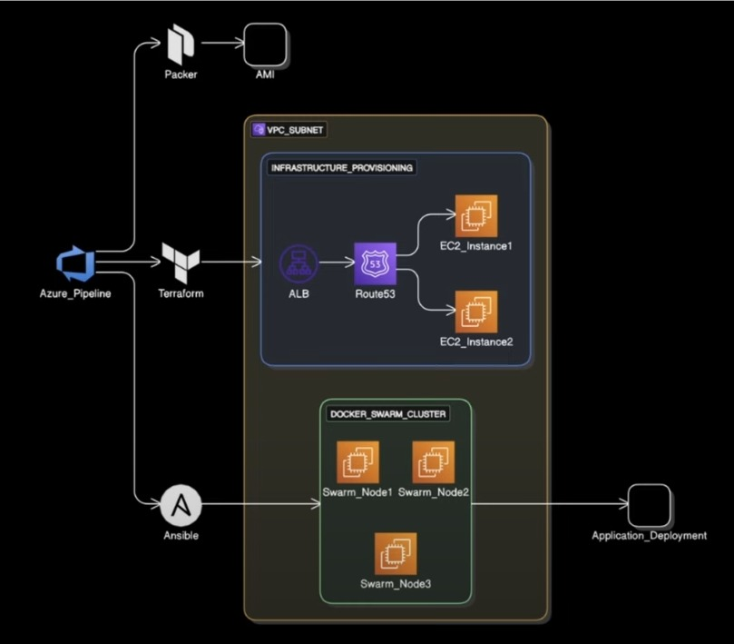

## 🏷️ Tags

# 🗳️ Deploying Docker Voting App on AWS using Azure DevOps, Terraform, Packer & Ansible

This project demonstrates the end-to-end deployment of the [Docker Sample Voting App](https://github.com/dockersamples/example-voting-app) on a Docker Swarm cluster running on AWS EC2 instances. The infrastructure is provisioned using **Terraform**, baked with **Packer**, and automated through **Azure DevOps Pipelines** and **Ansible**.

---

## 🚀 Tech Stack

- **Infrastructure Provisioning:** Terraform  
- **AMI Creation:** Packer  
- **CI/CD Pipeline:** Azure DevOps Pipelines  
- **Configuration Management:** Ansible  
- **Container Orchestration:** Docker Swarm  
- **Cloud Platform:** AWS EC2  

---

## 📌 Architecture Overview

- **Packer** creates custom AMIs with required pre-installed tools.  
- **Terraform** provisions:  
  - VPC and Subnets  
  - Application Load Balancer (ALB)  
  - EC2 Instances as Swarm Nodes (**No Route53 used**)  
- **Ansible** bootstraps Docker and initializes Swarm on the EC2 instances.  
- The Docker Swarm cluster deploys the voting app using a `docker-stack.yml` file.

---

## 🧱 Application Components (Docker Sample Voting App)

The microservices deployed in the stack include:

- **Vote App:** A Python-based frontend for voting  
- **Redis:** Stores the votes temporarily  
- **Worker:** A .NET app that transfers votes from Redis to Postgres  
- **Postgres:** Persistent database storage  
- **Result App:** A Node.js frontend displaying real-time results  

---

## 🔧 How It Works

1. **Azure DevOps Pipeline** triggers the workflow:
   - Runs Packer to build and register a custom AMI  
   - Executes Terraform scripts to provision the infrastructure  
   - Uses Ansible to:
     - Install Docker  
     - Initialize Docker Swarm  
     - Deploy the Docker Voting App stack  

2. **Deployment Output:**
   - Application Load Balancer routes traffic to EC2 Swarm nodes  
   - The voting app is accessible through the public DNS of the ALB  

---

